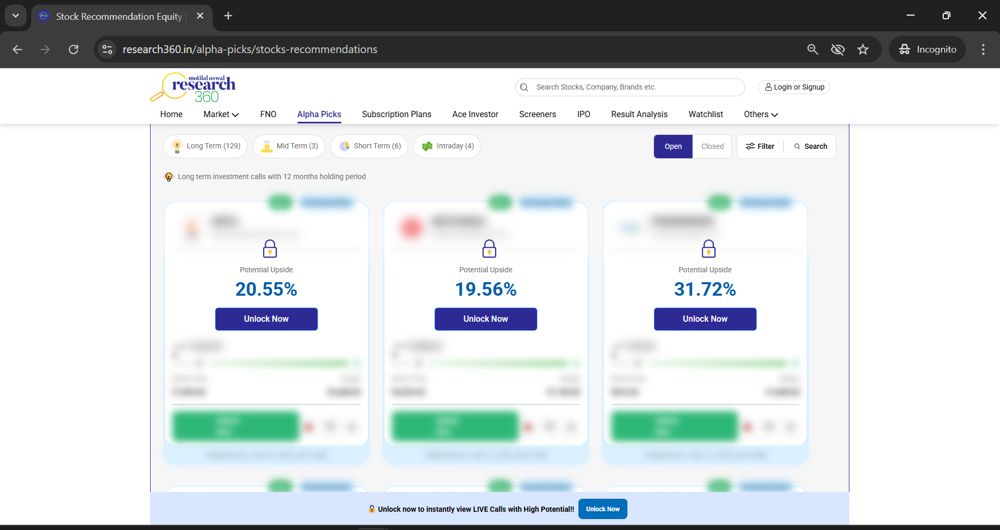
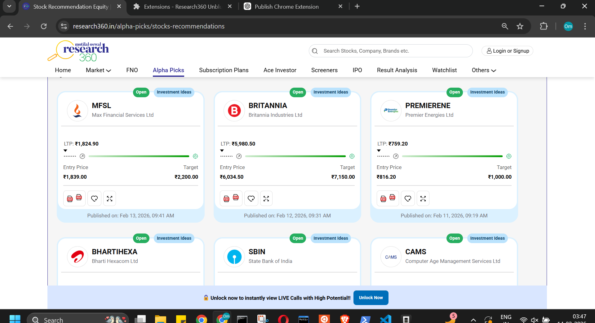

# Research360 Premium Unlocker

A simple Chrome extension to unlock premium research content on Research360.


## Preview

**Preview Blocked Recommendations:**


**Preview Unlocked Recommendations:**


## Features

- Unlocks blurred stock recommendation cards
- Makes PDF reports clickable
- Removes paywall overlays

## Installation

1. Clone the repo:
```bash
git clone https://github.com/ompathak2004/research360-viewer.git
```

2. Open Chrome and go to `chrome://extensions/`

3. Enable **Developer mode** (top right toggle)

4. Click **Load unpacked** and select the `research360-viewer` folder

5. Visit https://www.research360.in/alpha-picks/stocks-recommendations and browse any category

## Disclaimer

For personal use only. Respect the platform's terms of service.
